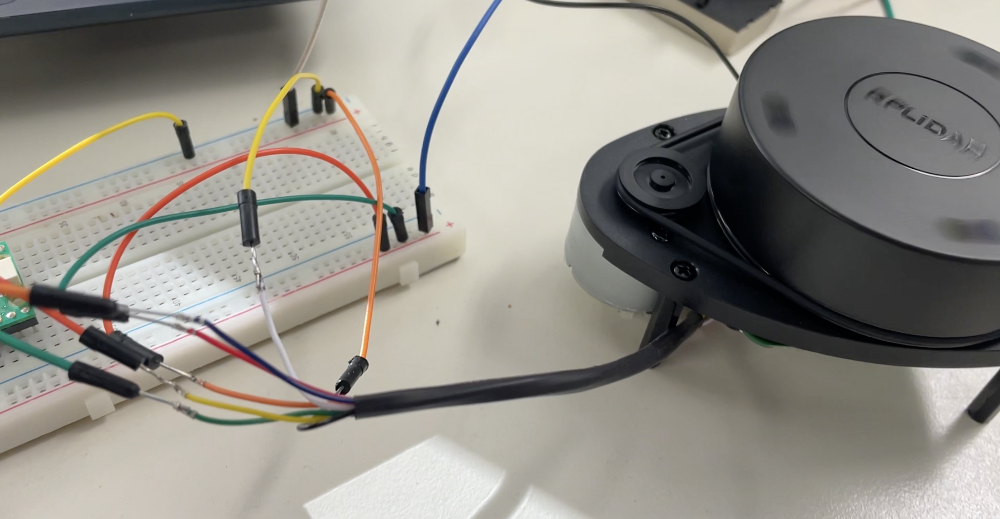
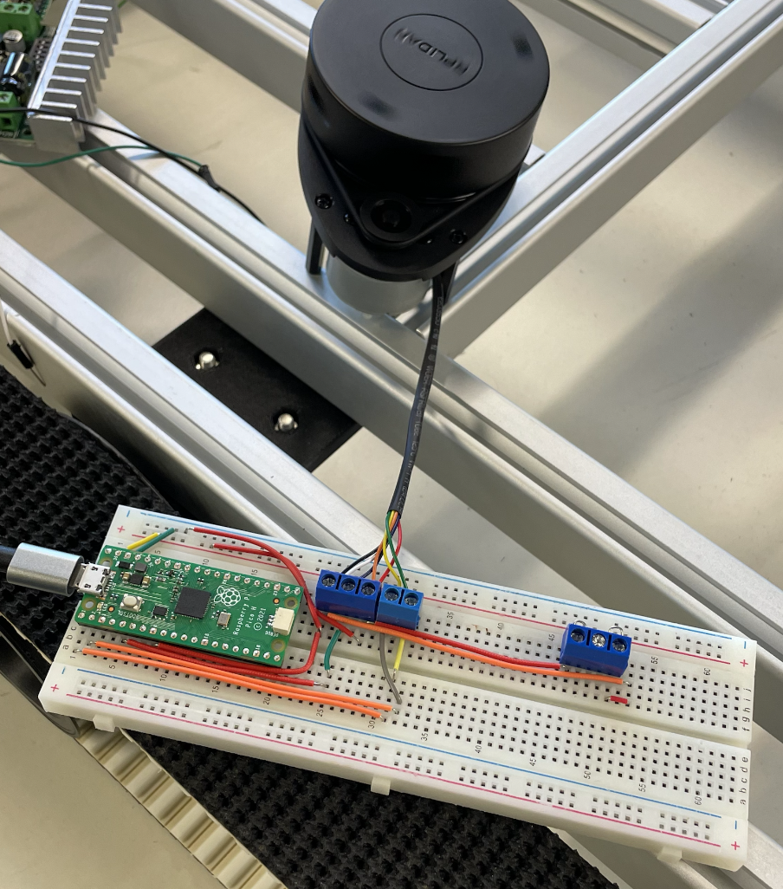
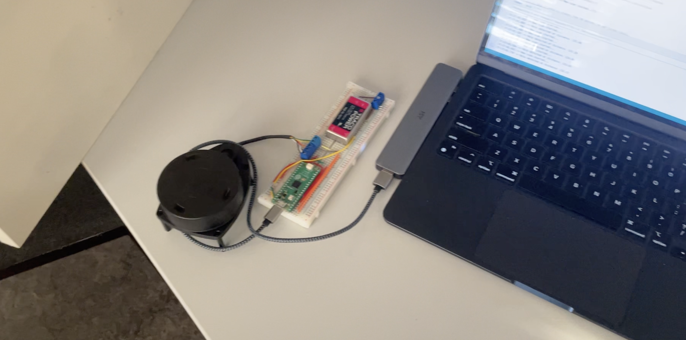
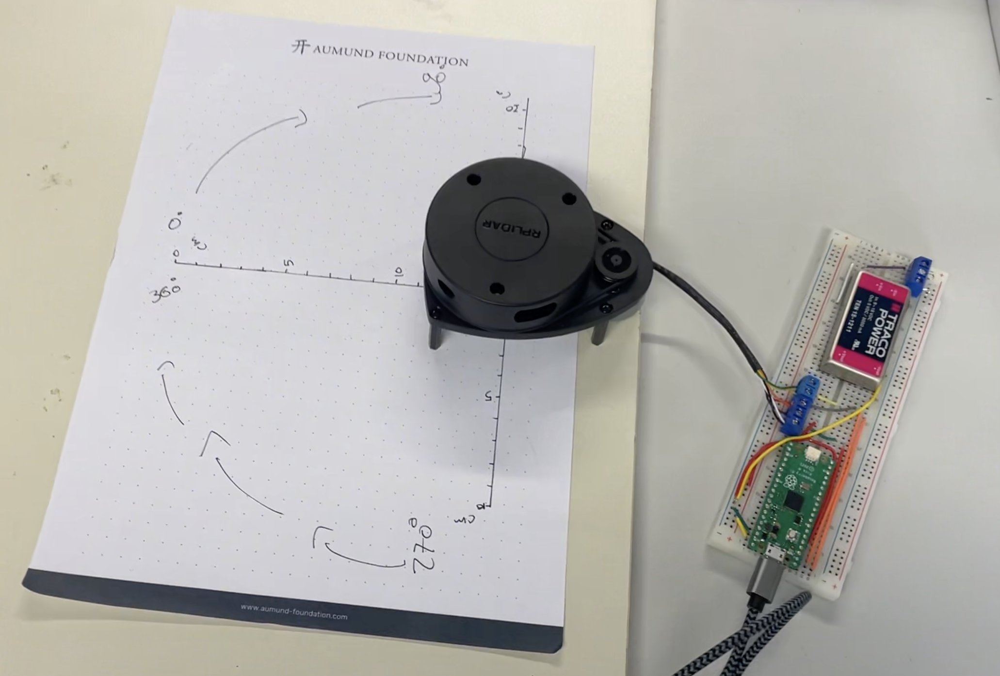
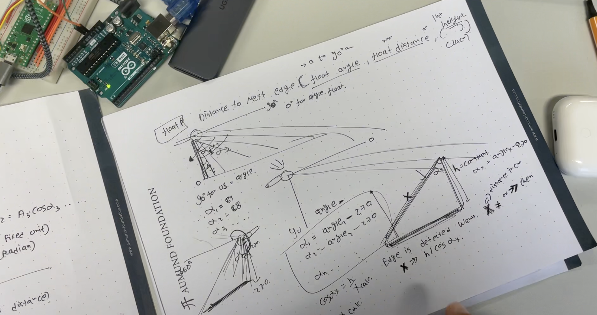
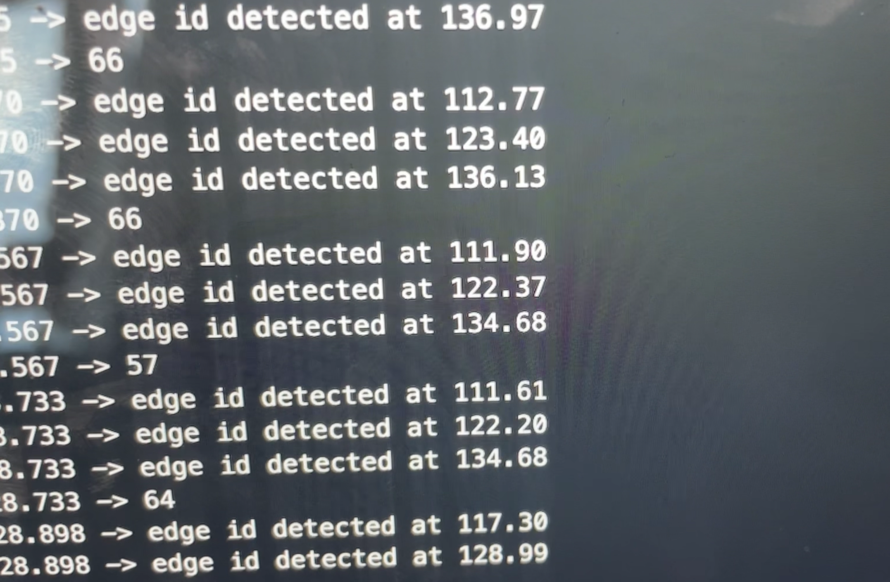
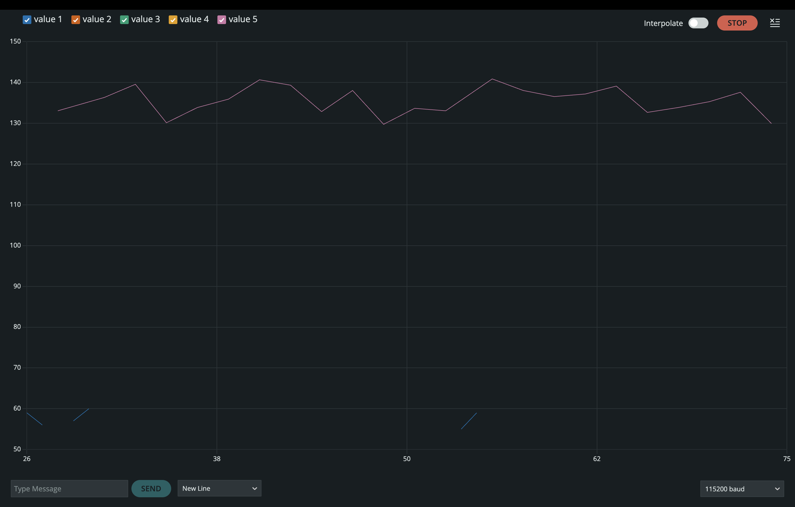
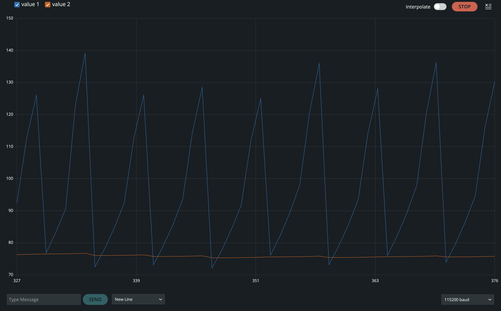

# 2D LIDAR Edge Detection using Raspberry Pi Pico

This project focuses on building a logic to calculate the distance to the next edge when a robot equipped with a 2D LIDAR sensor is placed on a table. The project leverages the **RPlidar.h** library and a **Raspberry Pi Pico** to work with the LIDAR sensor.

## Project Overview

I am currently in the process of refining this project, and so far, I've conducted several experiments to achieve the final goal—calculating the distance to the next edge detected by the LIDAR sensor.

For now, this project emphasizes:

- Building the logic for edge detection
- Working with the **RPlidar.h** library to process data from the 2D LIDAR sensor
- Using **Raspberry Pi Pico** as the hardware platform for the implementation

### Library Sources

The **RPlidar.h** library can be found here: [RPLidar Arduino Library](https://github.com/robopeak/rplidar_arduino/tree/master)

The **Filters** library for data filtering can be found here: [Arduino Filters Library](https://github.com/edargelies/arduino_eq/tree/master/libraries/Filters)

## Project Workflow

Here’s the workflow for this project and the current status of each task:

### - **Continuous Data Retrieval from LIDAR (Important)** – **DONE** (click to play the video) 

**Circuit Diagram:**

### - **LIDAR Hole Processor (Not so important)** – **DONE** (click to play the video) 

### - **Edge Detection using LIDAR (Important)** – **DONE** (click to play the video) 

### - **Calculating Distance to the Next Edge (Non-filtered)** – **DONE** (click to play the video)

### - **Calculating Distance to the Next Edge (filtered)** – **DONE** (click to play the video)

## Author

**Siddharth A. Patel**  
GitHub: [siddharthpatelde](https://github.com/siddharthpatelde?tab=overview&from=2024-10-01&to=2024-10-17)
